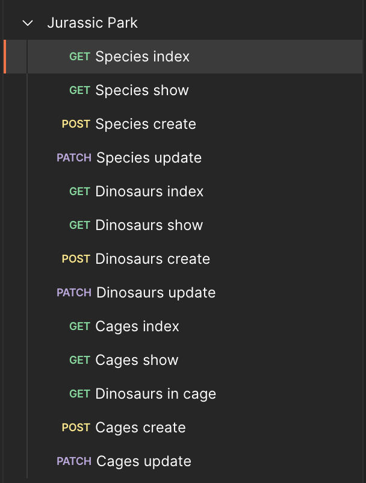
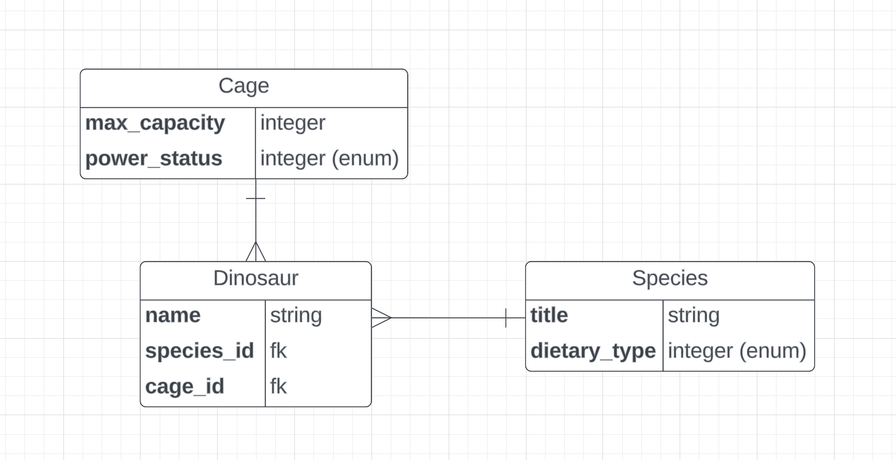

# README

### Table of contents
1. [Introduction](#introduction)
2. [Setup](#setup)
3. [Endpoints Documentation](#endpoints)
4. [Database Structure](#database-structure)
5. [Thoughts and Future Considerations](#some-thoughts)

## Introduction
This repository holds an API for a Jurassic Park administration tool.

It allows for administering information about the dinosaurs that are in the park,
the species that these dinosaurs pertain to, and the cages inside of which these dinosaurs will be held.

Below you will find some information about how to set up the project, how to use it, and some thoughts for a theoretical future for the project.

## Setup

Note that this project uses Ruby 3.2.2, and Rails 7.1.2. Getting those installed might be the biggest roadblock to running the project.
If you have issues, just replace those versions (in the gemfile) with whatever values you already
have installed on your machine, as there isn't anything in the project that requires the newest version of Ruby, nor of Rails.

However, if you are completely unable to run the project, the project is also live on heroku at https://jurassic-park-api-msking93-30c135d0fbde.herokuapp.com/cages. First hit https://jurassic-park-api-msking93-30c135d0fbde.herokuapp.com/cages to let the dyno (no pun intended) warm up, and then hit all the endpoints you'd like using postman, as you would for the local version.

1. Clone the repository to your machine (`git clone https://github.com/michaelsking1993/jurassic-park-api-test.git`)
2. `cd` into the project directory.
3. If you don't have Postgresql installed on your machine, run `brew install postgresql` (install homebrew if you do not already have it).
4. Execute `bundle install` to install dependencies. If you don't have this version of Ruby or Rails installed, this step might take a few minutes.
5. Execute `rails db:create` to create the database. If the command fails, I was able to fix my issue by running `brew services restart postgresql`, then re-running `rails db:create` (although it will obviously depend on what the issue is).
6. Execute `rails db:migrate` to setup the schema.
7. Execute `rails db:seed` to seed your database with some data if you don't want to create it all yourself (note: the previous 3 commands could be replaced by running `rails db:setup`, but I prefer to do these steps separately to more easily diagnose potential issues, such as the one I ran into in step 5).
8. Execute `rails s` to fire up the rails server
9. Execute `rspec` to run the test suite. All 43 tests should be passing.
10. At this point, go to a browser and input `localhost:3000/cages`, and if everything worked correctly, you should see a list of cages (assuming you ran the seed command from above). Go also to `localhost:3000/species` and `localhost:3000/dinosaurs` to triple check that things are setup correctly.

## Endpoints

Next, you should test the endpoints. Here you will find some documentation on each endpoint, and how to test it.

To test the show and update endpoints (including the endpoint showing a list of dinosaurs in a given cage), first hit the related index endpoint, grab an ID, and feed it into the endpoint in question.

To test the create endpoints, simply hit the endpoint with the request body formatted according to the below documentation.

The easiest way to do this (and the way I did it) was by using an application such as Postman.
I setup a group of endpoints that looked like this:

 - `GET /cages`
   - Returns a list of cages.
   - Cages can be filtered with a `power_status` parameter if desired, for example: `localhost:3000/cages?power_status=down` or `localhost:3000/cages?power_status=active`. The `power_status` parameter is case insensitive.
   - Status code will be a 200, but will return a 404 Not Found if an invalid `power_status` parameter is passed.

- `GET /cage/:id`
    - Returns a specific cage.
    - Status code will be a 200, or a 404 Not Found if a cage is not found with the given ID.

- `GET /cages/:cage_id/dinosaurs`
    - Returns a list of dinosaurs inside of a given cage, **including the name of the species it belongs to**.
    - Status code will a 200, or a 404 Not Found if a cage is not found with the given ID.

- `POST /cages`
    - Creates a cage with the passed parameters.
    - The request body must be formatted as follows: `{ cage: { max_capacity: integer, power_status: "active"/"down" } }`
    - Will return the cage object.
    - Status code will be a 201 Created, or a 422 Unprocessable Entity if parameters are invalid (except for an invalid power_status, which is discussed below)

- `PATCH /cages/:id`
    - Updates a cage with the passed parameters.
    - The request body must be formatted as follows: `{ cage: { max_capacity: integer, power_status: "active"/"down" } }`
    - Will return the cage object.
    - Status code will be a 200, or a 404 Not Found if no cage can be found with the given ID, or a 422 Unprocessable Entity if parameters are invalid (except for an invalid power_status, which is discussed below)

- `GET /dinosaurs`
    - Returns a list of dinosaurs.
    - Dinosaurs can be filtered with a `species_id` parameter if desired, for example: `localhost:3000/dinosaurs?species_id=4`.
    - Dinosaurs come back **with their associated species name included in the response**.
    - Status code will be 200, or a 404 Not Found if a species_id is passed but no species can be found with it.

- `GET /dinosaur/:id`
    - Returns a dinosaur with the given ID, including the species name.
    - Status code will be a 200, or a 404 Not Found if a dinosaur cannot be found with the given ID.

- `POST /dinosaurs`
    - Creates a dinosaur with the passed parameters.
    - The request body must be formatted as follows: `{ dinosaur: { species_id: INT, cage_id: INT, name: STRING }`
    - Returns the dinosaur object that was created, or a helpful error message.
    - Status code will be a 201 created, or a 422 Unprocessable Entity if parameters are invalid, or 404 not found if there is no cage or species found with the passed cage_id / species_id.

- `PATCH /dinosaurs/:id`
    - Updates a dinosaur with the passed parameters.
    - The request body must be formatted as follows (note that only 1 or more of the inner keys are required):  `{ dinosaur: { species_id: INT, cage_id: INT, name: STRING }`
    - Returns the dinosaur object that was updated.
    - Status code will be a 200, or a 404 Not Found if no dinosaur can be found with the given ID.

- `GET /species`
    - Returns a list of species in the database, **including how many dinosaurs in the park pertain to this species**.
    - Status code will be a 200

- `GET /species/:id_or_title`
  - Returns a species with the given ID, including how many dinosaurs in the park pertain to this species.
  - **can pass EITHER an ID, OR a name/title of the species**.
  - Status code will be a 200, or a 404 not found if no species can be found with the given ID or title.

- `POST /species`
  - Creates a species with the passed parameters
  - The request body must be formatted as follow: `{ species: { title: STRING, dietary_type: "herbivore"/"carnivore" } }`
  - Returns the species object created, or a a helpful error message.
  - Status code will be a 201 created, or a 422 Unprocessable Entity

- `PATCH /species/:id`
  - Updates a species with the passed parameters.
  - The request body must be formatted as follows (note that only 1 of the following keys need to be present to update the species): `{ species: { title: STRING, dietary_type: "herbivore"/"carnivore" } }`
  - Returns the species object that was updated.
  - Status code will be a 200, or a 404

## Database Structure

## Future TODOs that I did not get time for

The most obvious TODO for the future would be a frontend interface to handle this awesome application.

However, here are some less-obvious TODOs that I did not have time for:

 - TODO: handle invalid power_status / dietary_type parameters more gracefully. Rails has shockingly poor support for handling invalid parameters in the case of the integer-based enum fields (i.e. power_status in Cage model, and dietary_type in dinosaur model). If you pass an invalid parameter, it blows up with an ArgumentError, even if you add a custom validation. There are various ways to work around this, such as: 
   - 1) switch to storing these as a string and then use a custom validation (which removes our access to the convenience methods that using enums provides)
   - 2) rescue from ArgumentError at the controller level (but this means we would have to rescue in both the create and update actions of both the cages controller and the species controller, which is repetitive)
   - 3) add some custom modules to handle enums and/or errors more gracefully. But alas, did not have time to do this yet.
 - TODO: see if there's a way to move the cage validation logic that is currently found inside dinosaur.rb (due to cage_id being a dinosaur attribute) into the cage model. It is probably creating extra queries.
 - TODO: for the model specs that cover the appropriate column names being present, abstract those into a single test that loops over the tables and pulls from a hash of expected column names.
 - TODO: separate endpoint for moving a dinosaur to a cage. Currently, you must use the `update` endpoint for the dinosaur to do this. However, if the logic for moving a dinosaur becomes more complex, a separate endpoint might be considered, even if just for semantic clarity. For the moment, using the update endpoint suffices.

#### Considerations that are beyond the scope of this project:
 - Does a dinosaur always need a cage? For example, when a dinosaur first comes into the park, will there be a period of time in which they aren't in a cage but rather in some sort of holding space?
 - Could a dinosaur potentially be assigned multiple cages, and be able to rotate between them?